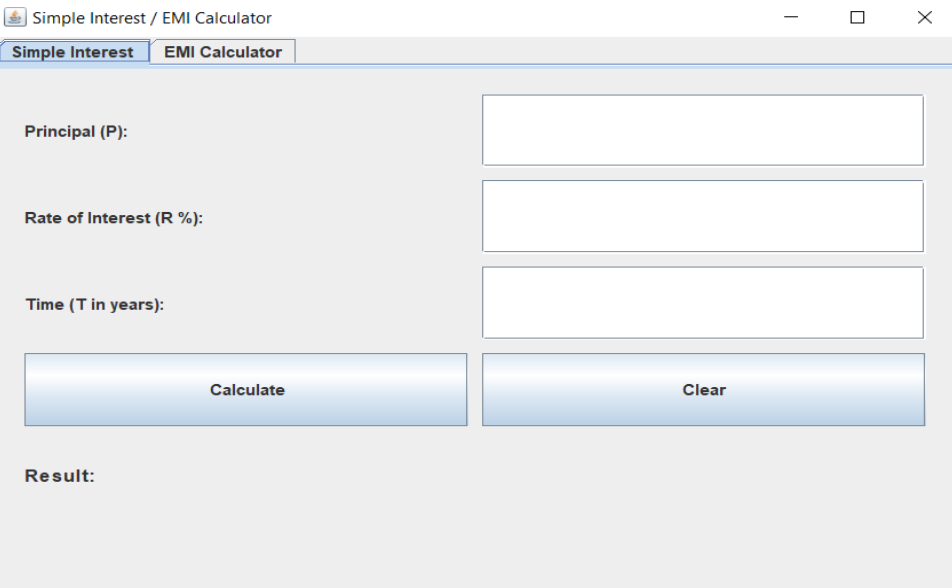
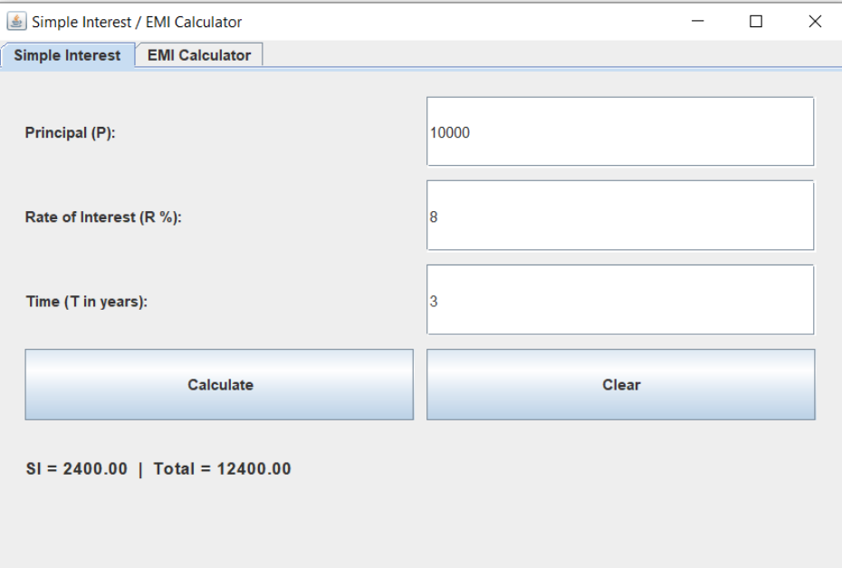
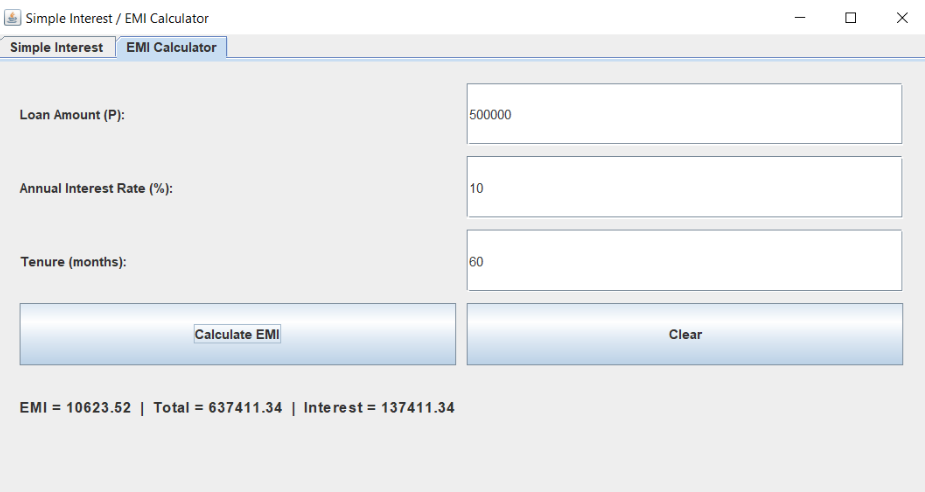
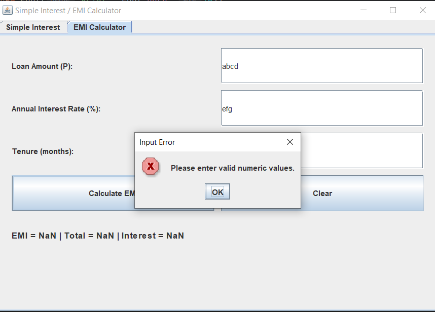

# 💰 SI & EMI Calculator

A Java desktop application with a dual-panel tabbed UI to calculate both Simple Interest and Equated Monthly Installments.

---

## 🚀 About

A Java Swing/AWT desktop app that provides two calculators in one window — Simple Interest and EMI — using a clean tabbed interface. Built using core Java OOP concepts with input validation and real-time results.

---

## 🛠️ Tech Stack

- Java
- Java Swing / AWT
- OOP Concepts

---

## ✨ Features

- Dual-panel tabbed UI (Simple Interest + EMI in one window)
- Calculates Simple Interest from principal, rate, and time
- Calculates EMI, total payment, and total interest for loans
- Input validation with error dialog for invalid/empty inputs
- Window launches centered on screen

---

## 📐 Formulas Used

**Simple Interest:**
```
SI = (P × R × T) / 100
Total = P + SI
```

**EMI:**
```
EMI = [P × r × (1 + r)^n] / [(1 + r)^n - 1]
```
Where:
- P = Principal loan amount
- r = Monthly interest rate (Annual Rate / 12 / 100)
- n = Loan tenure in months

---

## 📸 Preview

### 🖥️ Application Launch Screen


### 🧮 Simple Interest Calculation


### 📊 EMI Calculation


### ⚠️ Input Validation Error


---

## 📚 What I Learned

- Building GUI applications with Java Swing/AWT
- Working with `JTabbedPane` for multi-panel layouts
- Implementing financial formulas in Java
- Input validation using `JOptionPane` error dialogs
- Structuring a multi-feature Java desktop application

---

## 🔗 Links

- GitHub: https://github.com/Praful77Jha

---

Built while learning Java and exploring real-world desktop applications 🚀
